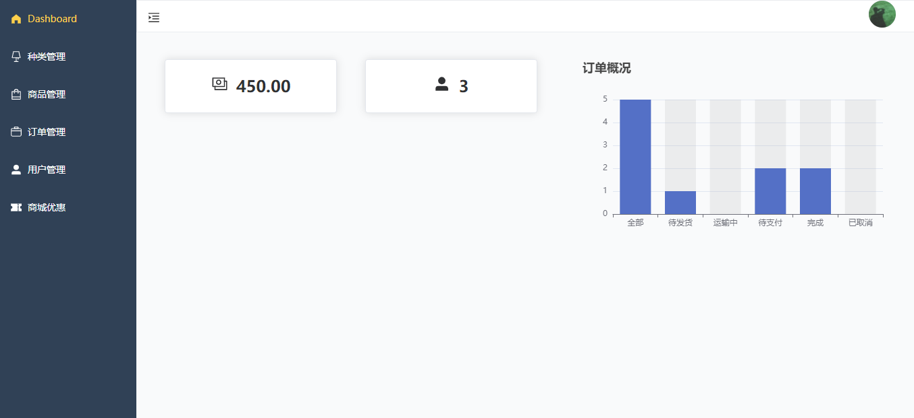
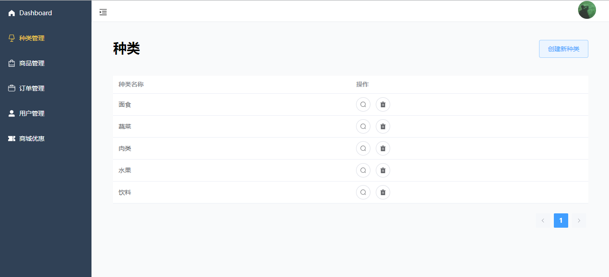
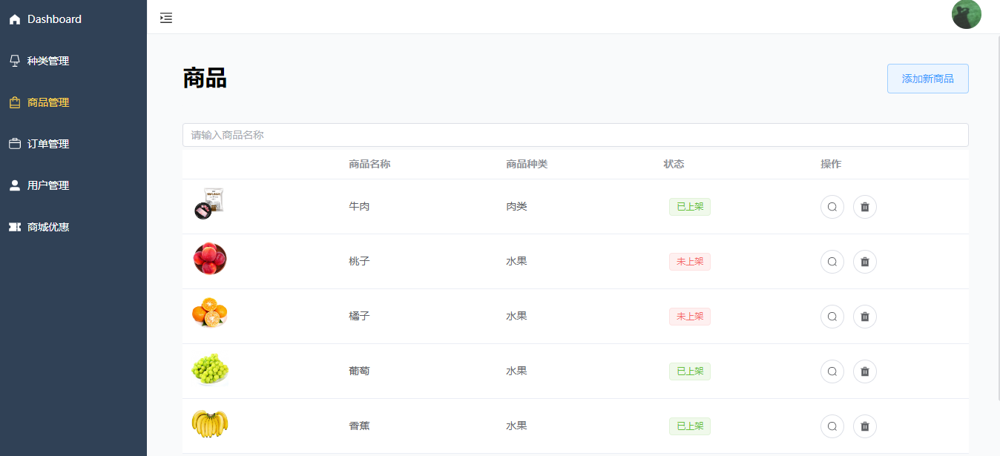
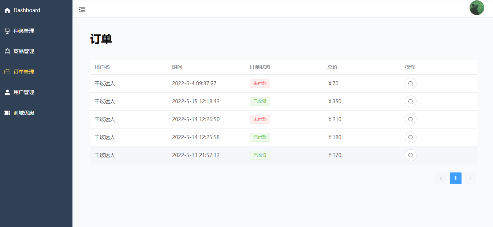
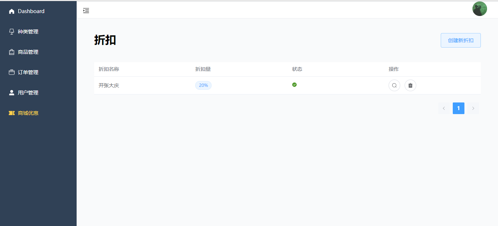

# Yolo商城后台管理系统

基于Vue的食品商城系统后台管理系统。
实现了管理员登录、种类管理、商品管理、订单管理、用户管理、商城优惠等模块。
## 技术栈
Vue + vue apollo + ElementUI + Echarts
## 系统展示












## 安装
```
yarn install
```
## 编译并运行
```
yarn serve
```